 

  

Full-stack and mobile work — commercial platforms, encrypted infrastructure, and iOS apps. 
Spanning marine IoT, desktop tools, and web.

  

---

### About

Engineering across the stack — embedded hardware, self-hosted infrastructure, iOS apps, and web front-ends. Clear implementation and interfaces that hold up in daily use.

Projects range from commercial IoT systems to smaller app experiments.

| | |
|:---:|:---|
| **iOS** | Native & React Native |
| **On-prem** | Self-hosted infra |
| **Cloud** | Any |

---

### Selected work

| | Project | What it is |
|:---:|:---|:---|
| **01** | [**Markour**](https://apps.apple.com/us/app/markour/id6760632864) | iOS drawing & whiteboard app — React Native, Expo, Skia |
| **02** | [**Bluelink**](https://spotzerobluelink.com) | Marine IoT — Touch 2.0, Connect, Update & MFD integration |
| **03** | **Nextcloud** | On-prem file server — compliance-driven, access-gated, local-first |
| **04** | [**PTS**](https://www.youtube.com/watch?v=Ba2qaQILcww) | Pistol training system — C# desktop, USB hub, wireless target nodes |
| **05** | [**DevCon1**](https://devcon1solutions.com) | Business site — Next.js, React, Firebase, client services & demos |

→ Full case studies at **[developdan.com](https://www.developdan.com)**

---

### Stack

---

### GitHub

 

---

  

*Open to select projects and collaborations.*

